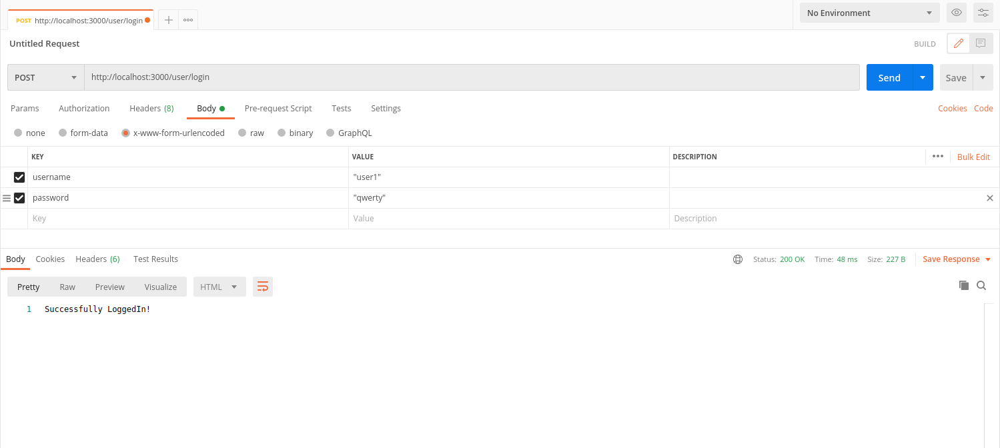
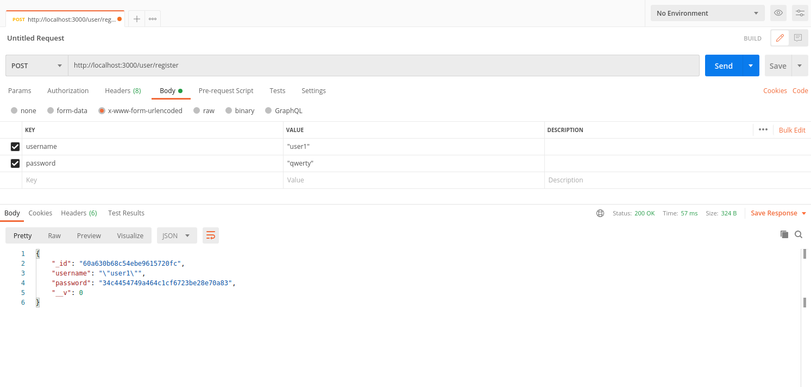
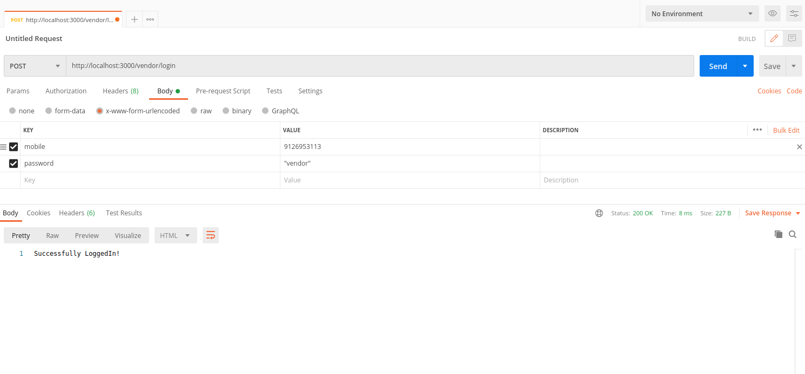
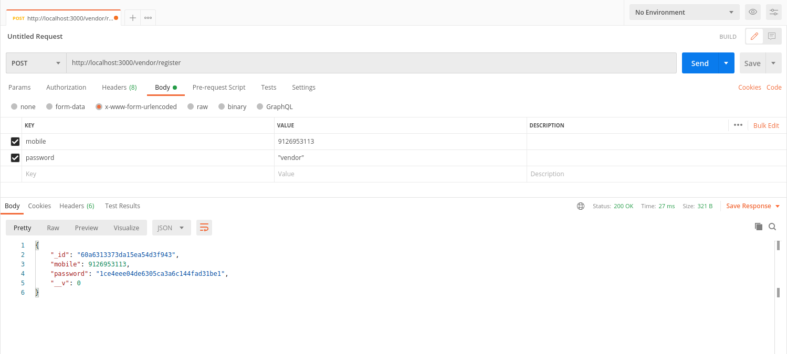
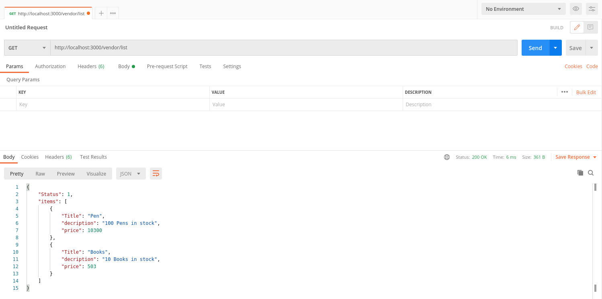

# Task-2 Authentication and Registration API for customer and shopkeeper
## TechStack :
<ul> 
  <li> Node.js</li>
  <li>Express.js</li>
  <li> MongoDB </li>
</ul>

## WorkFlow : 
<ul> <li> created mongoDB models for user and vendor.
  <li> connected app to mongoDB database.
   <li> Registerd users with username and password ,password is encrypted using md5 . Checked if the user is already registered it will give a  message that user already exists else saved the username and password in user database.</li>
<li> Registerd vendors with mobile and password ,password is encrypted using md5 . Checked if the vendor is already registered it will give a  message that vendor already exists else saved the username and password in user database.</li>
  <li>Before saving user and vendor into database checked if there credentials are valid or not.</li>
  <li> User can login with its registered username and password.
   <li> Vendor can loin with its registered mobile and password.
  <li> Vendor list can be accessed by the vendor.</li>
</ul>

## ScreenShots :
 ### User Login 

### User Resgistration: 

### Vendor Login 

### Vendor Registration

### Vendor List

## Download Packages 
  npm install 
